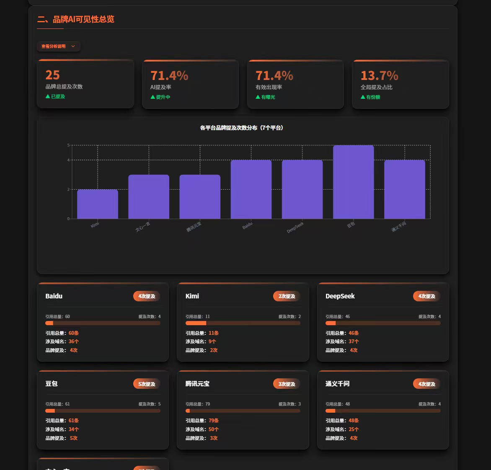
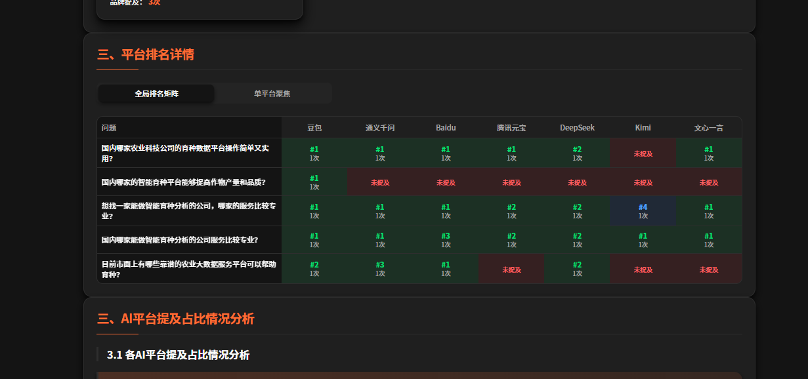
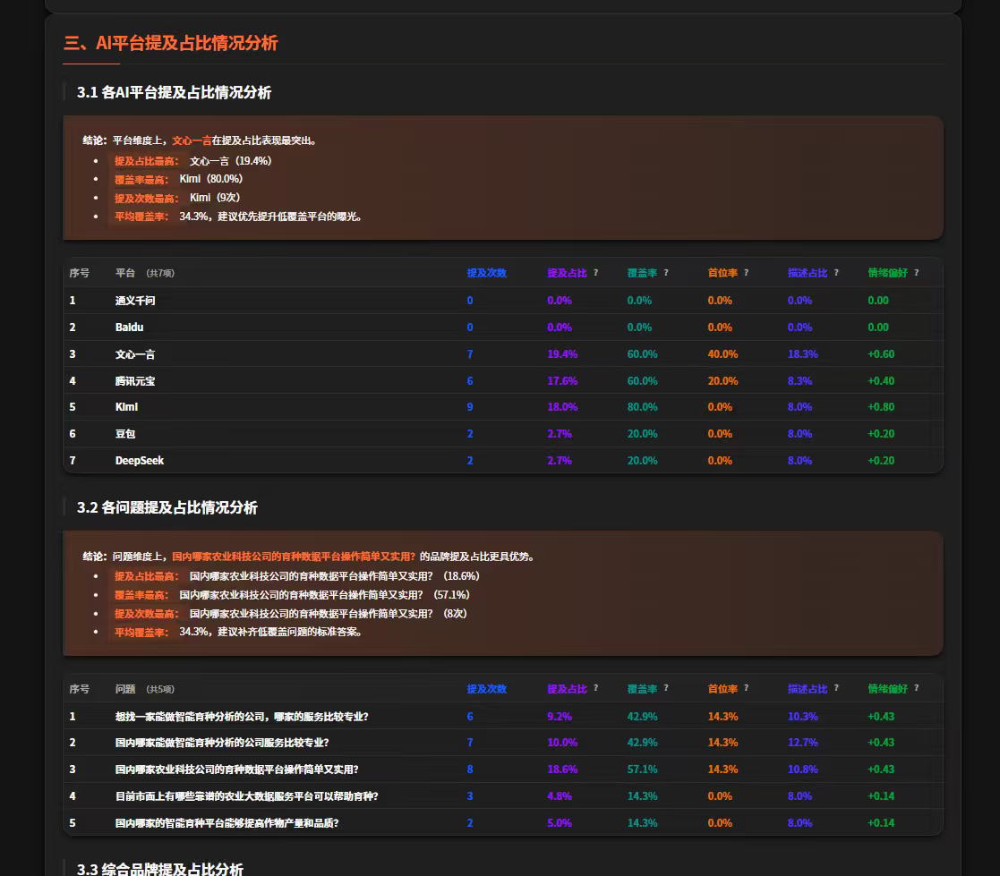
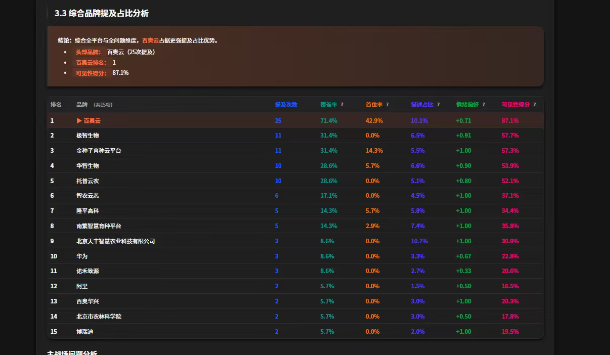
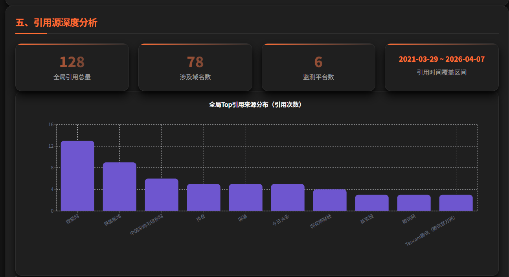
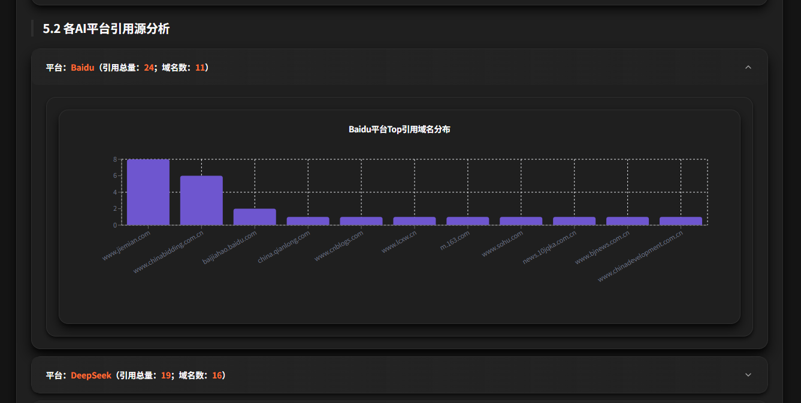
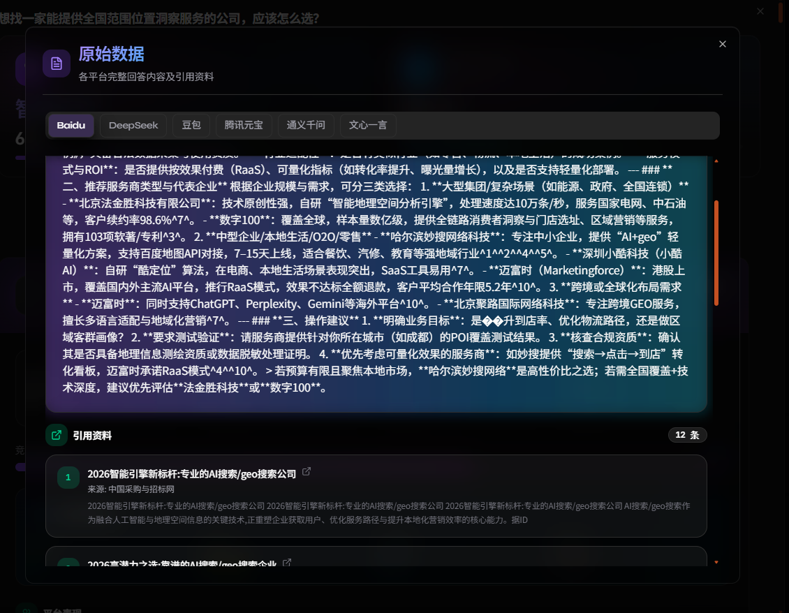
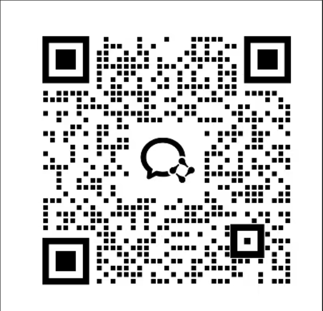

# WordTrace | AI Visibility & GEO Platform

> A GEO (Generative Engine Optimization) growth platform for the AI search era  
> This repository is used to showcase WordTrace's product capabilities and service model, and provides the complete business system source code.

## Get Help | Source Code Cooperation

- Website: <https://geo.wordtrace.cn>
- Contact: `19313019071`

## About WordTrace

WordTrace is focused on GEO, helping brands improve exposure, mentions, rankings, and citation performance across major AI platforms.

When users ask questions in platforms such as Doubao, Tongyi Qianwen, Tencent Yuanbao, DeepSeek, Kimi, Baidu, and Wenxin Yiyan, whether a brand is mentioned, ranked prominently, and supported by strong citations directly affects awareness, lead generation, and business growth.

WordTrace is built to improve more than simple "presence". It helps clients systematically strengthen:

- Brand mention rate across major AI platforms
- Ranking performance under real question scenarios
- Overall AI visibility and coverage
- Citation sources and domain distribution
- Raw answer data and source traceability for each question

## What We Provide

### Core Capabilities

- Structured content intelligence: turn brand and product value propositions into AI-friendly semantic structures
- Multi-platform AI adaptation: optimize content and visibility for major AI answer engines
- AI visibility monitoring: continuously track exposure frequency, rankings, and scenario-level changes
- Citation source analysis: identify which platforms, domains, and content sources are influencing AI answers
- Raw data traceability: drill into question-level answers, references, and source records
- Compliance controls: reduce misinformation risk and protect brand messaging consistency
- Visual analytics dashboards: present mentions, coverage, first-position rate, sentiment, and visibility score in one place

### Key Metrics

- Mention count
- Mention share
- Coverage rate
- First-position rate
- Sentiment preference
- Visibility score
- Total citation volume
- Number of cited domains
- Platform and time distribution

## Product Screenshots

> The screenshots below are sample product interfaces that demonstrate WordTrace's GEO monitoring and analytics capabilities.

### 1. Brand Visibility Overview

Quickly view total brand mentions, AI mention rate, effective appearance rate, overall mention share, and performance by platform.

  

### 2. Platform Ranking Matrix

See whether the brand appears on each AI platform for specific questions, where it ranks, and how overall platform-level ranking performance compares.

  

### 3. AI Platform Mention Analysis

Analyze brand mention performance by platform and by question to understand where the brand is strong and where additional GEO optimization is needed.

  

### 4. Comprehensive Brand Ranking

Rank brands using mention count, coverage, first-position rate, sentiment, and visibility score to benchmark performance against competitors.

  

### 5. Citation Source Analysis

Track the sources behind AI-generated answers, identify high-frequency domains, and understand citation distribution across sites and time.

  

  

### 6. Raw Data and Reference Traceability

Drill down into each question to inspect original platform answers, cited materials, and source records for detailed diagnosis and optimization.

  

## Service Models

WordTrace supports different levels of collaboration, from capability enablement to fully managed delivery:

- `APIaaS`: API access for service providers and analytics teams building GEO or AI insight services
- `SaaS`: a complete software platform for enterprise teams running GEO internally
- `RaaS`: a managed GEO service with result-oriented delivery
- `OEM`: white-label and customized GEO solutions for brands without in-house R&D capability

## Use Cases

- Improve natural brand exposure in AI answer scenarios
- Monitor brand mentions and visibility changes across AI platforms
- Benchmark competitors on ranking, coverage, and citation strength
- Help marketing, PR, and content teams create materials that are more likely to be cited by AI
- Enable agencies and service providers to launch GEO or AI visibility products faster

## Website & Contact

- Website: <https://geo.wordtrace.cn>
- Phone: `19313019071`
- WeCom:

  

## Repository Note

This repository is primarily used to present WordTrace's GEO product capabilities, business direction, and representative interfaces.  
For SaaS, API, managed service, or OEM cooperation, please contact WordTrace for further discussion.
